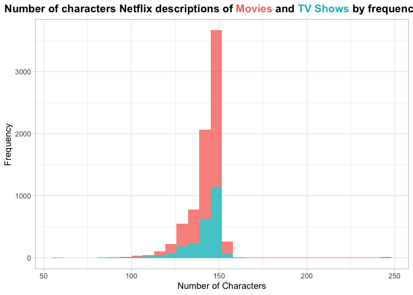
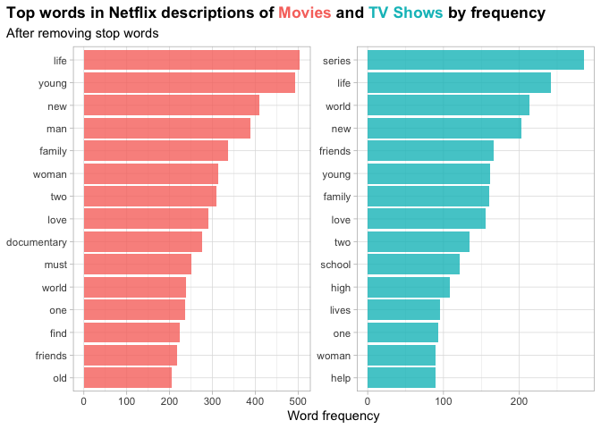
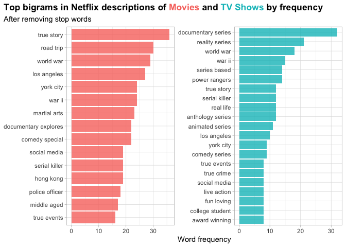
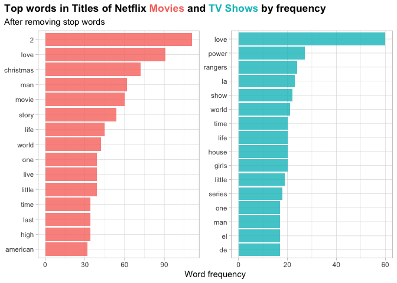
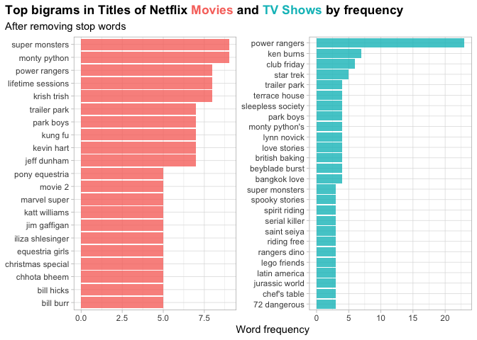
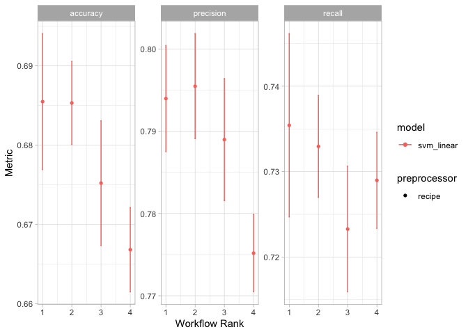
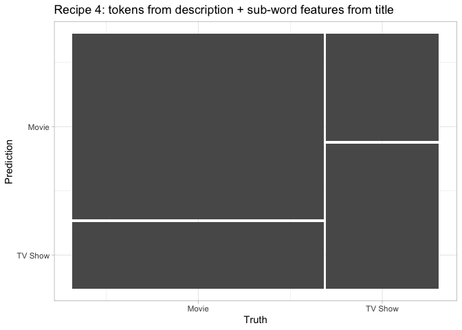
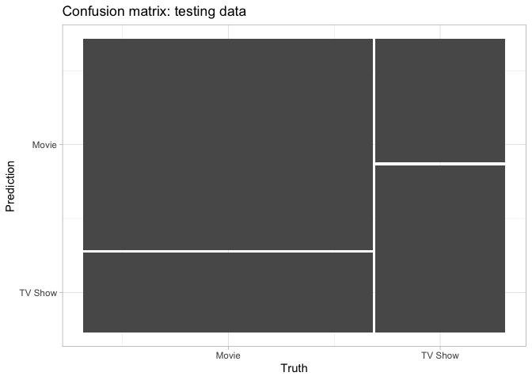
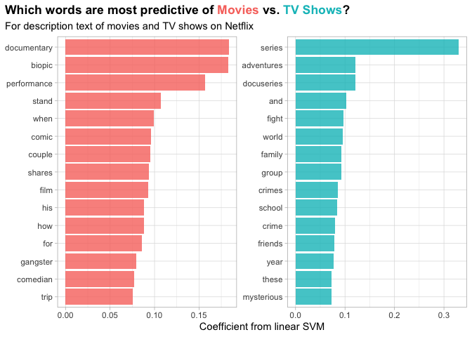

Building features from text to predicting classes with Tidy-Models
================

## Background

This projects is inspired by the [Apr 23, 2021 screecast
episode](https://www.youtube.com/watch?v=XYj8vyK864Y) of the fabulous
:star2:[Julia Silge](https://github.com/juliasilge?tab=repositories)
:star2:. In that post, Julia walks through how to build features from
text for tidy-modeling. I learned a lot, got inspired, and made this
post. Thank you, Julia :unicorn:.

Here, I aim to build a *Supervised Machine Learning Classification
Model* that can predict the type of whether a item in the Netflix
catalog is either a TV-Show or a Movie based on the description and/or
the title.

In doing so, I would practice using the
[`tidymodels`](https://www.tmwr.org/) and
[`textrecipes`](https://github.com/tidymodels/textrecipes) R packages
by:

-   Building features from text

-   Prepare different model recipes based on these features from text

    -   tokens from description
    -   tokens from description + tokens from title
    -   n-grams from description
    -   tokens from description + sub-word features from the title

-   Set up a SVM classification model to predict type (TV-Show or Movie)
    that trains, test, and compare all recipes
    ([`workflowsets`](https://github.com/tidymodels/workflowsets))

-   Compare models performance after 10-fold cross-validation

-   Identify and select the best model

-   Plot feature importance

Let’s get staRted !

``` r
# Load libraries
library(tidyverse)
library(tidymodels) 
library(tidytext)
library(textrecipes)
library(workflowsets)
library(themis)
library(ggtext)
library(patchwork)
theme_set(theme_light())

# At the time of making this script (April 2021), the SVM model was only available in the GitHub, development version of the parsnip package. 
#devtools::install_github("tidymodels/parsnip")
```

## Load Data

The data used for this project is the [week 17 dataset on Netflix
Titles](https://github.com/rfordatascience/tidytuesday/blob/master/data/2021/2021-04-20/readme.md)
of the [\#TidyTuesday](https://github.com/rfordatascience/tidytuesday).

``` r
# Load data from netflix movie and TV show titles from the tidyverse
netflix_titles <- read_csv("https://raw.githubusercontent.com/rfordatascience/tidytuesday/master/data/2021/2021-04-20/netflix_titles.csv")
```

## Explore Data

There are more Movies than TV-shows in the data (5 447 to 2 410,
respectively).

All items have a description of about the same length.

Titles often contain only numbers, dates, special characters—some in
languages other than English.

``` r
# How many titles in the dataset?
netflix_titles %>%
  count(type) 
```

    ## # A tibble: 2 x 2
    ##   type        n
    ##   <chr>   <int>
    ## 1 Movie    5377
    ## 2 TV Show  2410

``` r
# What do the descriptions look like? 
netflix_titles %>%
  slice_sample(n = 10) %>%
  pull(description)
```

    ##  [1] "A very chiseled but somber detective must find a serial killer who leaves clues that only his mentor's nerdy comics-loving son can decipher."           
    ##  [2] "Determined to give her son a private school education, a single mother in the inner city uses all her resources to try to effect change in the system." 
    ##  [3] "Hogie and his friends travel the world, exploring far-flung locales like Buenos Aires, Cairo, Hawaii and the Galapagos Islands."                        
    ##  [4] "This award-winning, original documentary chronicles the race for market leadership in 3D printing, the next wave of technological evolution."           
    ##  [5] "In need of money, an eccentric ex-spy and his younger octogenarian partner embark on an international quest for a valuable Soviet soda formula."        
    ##  [6] "Following his best friend's death, Arci takes charge of her two boisterous children with some help from their gang-affiliated uncle."                   
    ##  [7] "After a snowmobile accident paralyzed him, Grant Korgan became the first athlete with a spinal cord injury to push himself to the South Pole."          
    ##  [8] "A pregnancy forces an actress out of her latest play and into a difficult confrontation with her own rapidly transforming reflection."                  
    ##  [9] "An officer in a top-secret CIA unit leads his team in escorting a prized intelligence asset to safety, with enemy forces hot on their trail."           
    ## [10] "In an attempt to settle the \"nature vs. nurture\" debate, a scientist couple raises three children to live lives that defy their genetic dispositions."

``` r
# What do titles look like?
netflix_titles %>%
  slice_sample(n = 10) %>%
  pull(title)
```

    ##  [1] "God's Not Dead: A Light in Darkness"   
    ##  [2] "Death Can Wait"                        
    ##  [3] "American Horror Story"                 
    ##  [4] "Hangar 1: The UFO Files"               
    ##  [5] "She's Dating the Gangster"             
    ##  [6] "The Theory of Everything"              
    ##  [7] "Trailer Park Boys: The Animated Series"
    ##  [8] "Paskal"                                
    ##  [9] "Barbie: A Fairy Secret"                
    ## [10] "The Last Airbender"

### Description field

This column contains the description of the Movies and TV Shows: are all
around 150 characters long. The histogram of the number of characters
per description by type also highlights the issue of balance in the
sample: there are more movies than TV Shows.

``` r
# Histogram of number of characters per description by type
netflix_titles %>%
  select(type, description) %>%
  mutate(n_char = nchar(description)) %>%
  ggplot(aes(x=n_char, fill=type)) +
  geom_histogram(show.legend = FALSE, alpha = 0.8) + 
  labs(
    x = "Number of Characters", y = "Frequency",
    title = "<strong>Number of characters Netflix descriptions of <span style = 'color:#F8766D'>Movies</span> and <span style = 'color:#00BFC4'>TV Shows</span> by frequency</strong>",
    subtitle = NULL
  ) +
  theme(plot.title = element_markdown(),  
        plot.title.position = "plot")
```

<!-- -->

Word frequency analysis of the description field show some differences
in the top words for each category as well as some similarities.

``` r
# What are the top words in the description each category (Movie, TV Show)?
netflix_titles %>%
  # create tokens at the word level for the description column
  unnest_tokens(word, description) %>%
  # remove stop-words
  anti_join(get_stopwords()) %>%
  # get frequencies for each word for each category, sort in desc order
  count(type, word, sort = TRUE) %>%
  # group by category
  group_by(type) %>%
  # get the top 15 most commonly used words
  slice_max(n, n = 15) %>%
  # ungroup
  ungroup() %>%
  # reorder word column by frequency and category
  mutate(word = reorder_within(word, n, type)) %>%
  # Plot frequencies
  ggplot(aes(n, word, fill = type)) +
  geom_col(show.legend = FALSE, alpha = 0.8) +
  scale_y_reordered() +
  facet_wrap(~type, scales = "free") +
  labs(
    x = "Word frequency", y = NULL,
    title = "<strong>Top words in Netflix descriptions of <span style = 'color:#F8766D'>Movies</span> and <span style = 'color:#00BFC4'>TV Shows</span> by frequency</strong>",
    subtitle = "After removing stop words"
  ) +
  theme(plot.title = element_markdown(),  
        plot.title.position = "plot", 
        strip.background = element_blank(),
        strip.text.x = element_blank() )
```

<!-- -->

#### Bi-grams in the description field

We can also tokenize text into consecutive sequences of words, called
`n-grams`. This way, we can use how often word *X* is followed by word
*Y* in model building.

``` r
# What are the top words in the description each category (Movie, TV Show)?
netflix_titles %>%
  # create tokens bigram tokens for the description field
  unnest_tokens(bigram, description, token = "ngrams", n = 2 ) %>%
  # separaye the bi-gram into two columns: word1 and word 2
  separate(bigram, c("word1", "word2"), sep = " ") %>%
  # remove stop words from the bi grams
  filter(!word1 %in% stop_words$word) %>%
  filter(!word2 %in% stop_words$word) %>%
  # Unite back the filteres bi-grams into one column
  unite(bigram, word1, word2, sep = " ") %>%
  # get frequencies for each word for each category, sort in desc order
  count(type, bigram, sort = TRUE) %>%
  # group by category
  group_by(type) %>%
  # get the top 15 most commonly used words
  slice_max(n, n = 15) %>%
  # ungroup
  ungroup() %>%
  # reorder word column by frequency and category
  mutate(bigram = reorder_within(bigram, n, type)) %>%
  # Plot frequencies
  ggplot(aes(n, bigram, fill = type)) +
  geom_col(show.legend = FALSE, alpha = 0.8) +
  scale_y_reordered() +
  facet_wrap(~type, scales = "free") +
  labs(
    x = "Word frequency", y = NULL,
    title = "<strong>Top bigrams in Netflix descriptions of <span style = 'color:#F8766D'>Movies</span> and <span style = 'color:#00BFC4'>TV Shows</span> by frequency</strong>",
    subtitle = "After removing stop words"
  ) +
  theme(plot.title = element_markdown(),  
        plot.title.position = "plot",
        strip.background = element_blank(),
        strip.text.x = element_blank())
```

<!-- -->

### Title field

Words in the title of the TV Show or Movie are not unique to each
category. “Love”, for example, is one of the frequent word in the titles
of both movies and TV shows. Similarly with “world”, “life”, “little”,
“one”. This field does not seem to contain enough information to help a
model differentiate TV Shows from Movies based on the title.

``` r
# What are the top words in the title of each category (Movie, TV Show)?
netflix_titles %>%
  # create tokens at the word level for the title column
  unnest_tokens(word, title) %>%
  # remove stopwords
  anti_join(get_stopwords()) %>%
  # get frequencies for each word for each category, sort in desc order
  count(type, word, sort = TRUE) %>%
  # group by category
  group_by(type) %>%
  # get the top 15 most commonly used words
  slice_max(n, n = 15) %>%
  # ungroup
  ungroup() %>%
  # reorder word column by frequency and category
  mutate(word = reorder_within(word, n, type)) %>%
  # Plot frequencies
  ggplot(aes(n, word, fill = type)) +
  geom_col(show.legend = FALSE, alpha = 0.8) +
  scale_y_reordered() +
  facet_wrap(~type, scales = "free") +
  labs(
    x = "Word frequency", y = NULL,
    title = "<strong>Top words in Titles of Netflix <span style = 'color:#F8766D'>Movies</span> and <span style = 'color:#00BFC4'>TV Shows</span> by frequency</strong>",
    subtitle = "After removing stop words"
  ) +
  theme(plot.title = element_markdown(),  
        plot.title.position = "plot", 
        strip.background = element_blank(),
        strip.text.x = element_blank())
```

    ## Joining, by = "word"

<!-- -->

#### Bi-grams in the title field

This feature does not contain much information to differentiate between
Netflix Movies and TV-shows. It will not be used in models recipes.

``` r
# What are the top words in the description each category (Movie, TV Show)?
netflix_titles %>%
  # create tokens bigram tokens for the description field
  unnest_tokens(bigram, title, token = "ngrams", n = 2 ) %>%
  # remove NAs
  drop_na(bigram) %>%
  # separate the bi-gram into two columns: word1 and word 2
  separate(bigram, c("word1", "word2"), sep = " ") %>%
  # remove stop words from the bi grams
  filter(!word1 %in% stop_words$word) %>%
  filter(!word2 %in% stop_words$word) %>%
  # Unite back the filteres bi-grams into one column
  unite(bigram, word1, word2, sep = " ") %>%
  # get frequencies for each word for each category, sort in desc order
  count(type, bigram, sort = TRUE) %>%
  # group by category
  group_by(type) %>%
  # get the top 15 most commonly used words
  slice_max(n, n = 15) %>%
  # ungroup
  ungroup() %>%
  # reorder word column by frequency and category
  mutate(bigram = reorder_within(bigram, n, type)) %>%
  # Plot frequencies
  ggplot(aes(n, bigram, fill = type)) +
  geom_col(show.legend = FALSE, alpha = 0.8) +
  scale_y_reordered() +
  facet_wrap(~type, scales = "free") +
  labs(
    x = "Word frequency", y = NULL,
    title = "<strong>Top bigrams in Titles of Netflix <span style = 'color:#F8766D'>Movies</span> and <span style = 'color:#00BFC4'>TV Shows</span> by frequency</strong>",
    subtitle = "After removing stop words"
  ) +
  theme(plot.title = element_markdown(),  
        plot.title.position = "plot",
        strip.background = element_blank(),
        strip.text.x = element_blank())
```

<!-- -->

## Set up for tidy-modeling

We first define the split in the original data into training and testing
set (75% and 25%, respectively). Then, we define the cross-validation
folds in the training set.

``` r
# Set seed for reproducibility
set.seed(123)
# Define the splits in the data
netflix_split <- netflix_titles %>%
  select(type, description, title) %>%
  # stratify split samples by type (TV Shows vs Movie). The sample is not balanced (not a 50:50 split). Thus, we must take care that the splitting is balanced.
  # The inital split is 3/4 to training, 1/4 to testing
  initial_split(strata = type)

# Define the training set
netflix_train <- training(netflix_split)
# Define the testing set
netflix_test <- testing(netflix_split)


# Set seed for reproducibility
set.seed(234)
# Define the CV folds in the training dataset, stratified again by type
netflix_folds <- vfold_cv(netflix_train, strata = type)

# Print the sample division by fold
netflix_folds
```

    ## #  10-fold cross-validation using stratification 
    ## # A tibble: 10 x 2
    ##    splits             id    
    ##    <list>             <chr> 
    ##  1 <split [5256/585]> Fold01
    ##  2 <split [5256/585]> Fold02
    ##  3 <split [5256/585]> Fold03
    ##  4 <split [5257/584]> Fold04
    ##  5 <split [5257/584]> Fold05
    ##  6 <split [5257/584]> Fold06
    ##  7 <split [5257/584]> Fold07
    ##  8 <split [5257/584]> Fold08
    ##  9 <split [5258/583]> Fold09
    ## 10 <split [5258/583]> Fold10

## Define model recipes

We will define four model recipes:

-   recipe 1: using only tokens from description

-   recipe 2: using tokens from description + tokens from title

-   recipe 3: using n-grams from description

-   recipe 4: using tokens from description + sub-word features from the
    title

For all recipes, we will use
[`step_smote`](https://themis.tidymodels.org/reference/step_smote.html)
on type. This function generates new examples of the minority class
using nearest neighbors of these cases. It helps us create new data as
the dataset is unbalanced: move movies than TV shows.

``` r
# create our feature engineering recipe and our model, and then put them together in a modeling workflow

# Recipe 1: using only tokens from description
netflix_rec1 <- 
  # Define the model and the (training) data
  recipe(type ~ description, data = netflix_train) %>%
  # Define the steps of processing
  # tokenize text in description
  step_tokenize(description) %>%
  # filter tokenlist based on frequency
  step_tokenfilter(description, max_tokens = 1e3) %>%
  # convert tokelist into a term-frequency-inverse document freq (columns with 0-1)
  step_tfidf(description) %>%
  # normalize all 0-1 columns
  step_normalize(all_numeric_predictors()) %>%
  # generate new examples of the minority class using nearest neighbors of these cases
  step_smote(type)

# Print the recipe
netflix_rec1
```

    ## Data Recipe
    ## 
    ## Inputs:
    ## 
    ##       role #variables
    ##    outcome          1
    ##  predictor          1
    ## 
    ## Operations:
    ## 
    ## Tokenization for description
    ## Text filtering for description
    ## Term frequency-inverse document frequency with description
    ## Centering and scaling for all_numeric_predictors()
    ## SMOTE based on type

``` r
# Recipe 2: using only tokens from description + tokens from title
netflix_rec2 <- 
  # Define the model and the (training) data
  recipe(type ~ description + title, data = netflix_train) %>%
  # Define the steps of processing
  # tokenize text
  step_tokenize(description, title) %>%
  # filter tokenlist based on frequency
  step_tokenfilter(description, title, max_tokens = 1e3) %>%
  # convert tokelist into a term-frequency-inverse document freq (columns with 0-1)
  step_tfidf(description, title) %>%
  # normalize all 0-1 columns
  step_normalize(all_numeric_predictors()) %>%
  # generate new examples of the minority class using nearest neighbors of these cases
  step_smote(type)

# Print the recipe
netflix_rec2
```

    ## Data Recipe
    ## 
    ## Inputs:
    ## 
    ##       role #variables
    ##    outcome          1
    ##  predictor          2
    ## 
    ## Operations:
    ## 
    ## Tokenization for description, title
    ## Text filtering for description, title
    ## Term frequency-inverse document frequency with description, title
    ## Centering and scaling for all_numeric_predictors()
    ## SMOTE based on type

``` r
# Recipe 3: using n-grams from description
netflix_rec3 <- 
  # Define the model and the (training) data
  recipe(type ~ description, data = netflix_train) %>%
  # Define the steps of processing
  # tokenize text
  step_tokenize(description) %>%
  # create n-grams: include mono and bi-grams
  step_ngram(description, min_num_tokens = 1, num_tokens = 2) %>%
  # filter tokenlist based on frequency
  step_tokenfilter(description, max_tokens = 1e3) %>%
  # convert tokelist into a term-frequency-inverse (columns with 0-1)
  step_tfidf(description) %>%
  # normalize all 0-1 columns
  step_normalize(all_numeric_predictors()) %>%
  # generate new examples of the minority class using nearest neighbors of these cases
  step_smote(type)

# Print the recipe
netflix_rec3
```

    ## Data Recipe
    ## 
    ## Inputs:
    ## 
    ##       role #variables
    ##    outcome          1
    ##  predictor          1
    ## 
    ## Operations:
    ## 
    ## Tokenization for description
    ## ngramming for description
    ## Text filtering for description
    ## Term frequency-inverse document frequency with description
    ## Centering and scaling for all_numeric_predictors()
    ## SMOTE based on type

``` r
netflix_rec4 <- 
  # Define the model and the (training) data
  # Type is explained by the text in description and in title
  recipe(type ~ description + title, data = netflix_train) %>%
  # Define the steps of processing
  # tokenize text in description
  step_tokenize(description) %>%
  # filter tokenlist based on frequency
  step_tokenfilter(description, max_tokens = 1e3) %>%
  # convert tokelist into a term-frequency-inverse document freq (columns with 0-1)
  step_tfidf(description) %>%
  # tokenize
  step_tokenize(title,
    engine = "tokenizers.bpe",
    training_options = list(vocab_size = 200)
  ) %>%
  # filter tokenlist based on frequency
  step_tokenfilter(title, max_tokens = 200) %>%
  # convert tokelist into a term-frequency (columns with 0-1)
  step_tfidf(title) %>%
  # normalize all 0-1 columns
  step_normalize(all_numeric_predictors()) %>%
  # step_smote generates new examples of the minority class using nearest neighbors of these cases
  step_smote(type)


# Print the recipe
netflix_rec4
```

    ## Data Recipe
    ## 
    ## Inputs:
    ## 
    ##       role #variables
    ##    outcome          1
    ##  predictor          2
    ## 
    ## Operations:
    ## 
    ## Tokenization for description
    ## Text filtering for description
    ## Term frequency-inverse document frequency with description
    ## Tokenization for title
    ## Text filtering for title
    ## Term frequency-inverse document frequency with title
    ## Centering and scaling for all_numeric_predictors()
    ## SMOTE based on type

## Define model: type and engine

For this project, we will use one model: [a linear support-vector
machine classification
model](https://parsnip.tidymodels.org/reference/svm_linear.html). All
recipes defines above will be passed to this model.

At the time of making this script (April 2021), the SVM model was only
available in the GitHub, development version of the parsnip package.

``` r
#devtools::install_github("tidymodels/parsnip")

# SVM linear
svm_spec <- svm_linear() %>%
  # set engine to linear SVM
  set_engine("LiblineaR") %>%
  # define more to classification (categorical prediction)
  set_mode("classification")
```

## Define workflow set

``` r
# Define workflow_set
netflix_wf <- workflow_set(
  # define the pre-processing recipes
                preproc =list(base = netflix_rec1,
                              tokens_desc_title = netflix_rec2,
                              ngrams_desc = netflix_rec3,
                              tokens_desc_subwork_title = netflix_rec4) ,
  # define the models: in this case only 1
                models = list(svm_spec)
)

# Print workflow
netflix_wf
```

    ## # A workflow set/tibble: 4 x 4
    ##   wflow_id                             info                 option    result    
    ##   <chr>                                <list>               <list>    <list>    
    ## 1 base_svm_linear                      <tibble[,4] [1 × 4]> <opts[0]> <list [0]>
    ## 2 tokens_desc_title_svm_linear         <tibble[,4] [1 × 4]> <opts[0]> <list [0]>
    ## 3 ngrams_desc_svm_linear               <tibble[,4] [1 × 4]> <opts[0]> <list [0]>
    ## 4 tokens_desc_subwork_title_svm_linear <tibble[,4] [1 × 4]> <opts[0]> <list [0]>

## Fit model

``` r
# Set up parallel processing
doParallel::registerDoParallel()

# set seed for reproducibility
set.seed(12345)

svm_rs <- netflix_wf %>%
  # The first argument is a function name from the {{tune}} package
  # such as `tune_grid()`, `fit_resamples()`, etc.
  workflow_map("fit_resamples",
               # define the cross-validation folds
               resamples = netflix_folds, 
              # linear SVM model does not support class probabilities, so we need to set a custom metric_set() that only includes metrics for hard class probabilities
               metrics = metric_set(accuracy, recall, precision),
              # save the predictions from the model to make a confusion matrix
              control = control_resamples(save_pred = TRUE),
              verbose = TRUE)
```

    ## i 1 of 4 resampling: base_svm_linear

    ## ✓ 1 of 4 resampling: base_svm_linear (1m 40s)

    ## i 2 of 4 resampling: tokens_desc_title_svm_linear

    ## ✓ 2 of 4 resampling: tokens_desc_title_svm_linear (2m 9s)

    ## i 3 of 4 resampling: ngrams_desc_svm_linear

    ## ✓ 3 of 4 resampling: ngrams_desc_svm_linear (2m 0.9s)

    ## i 4 of 4 resampling: tokens_desc_subwork_title_svm_linear

    ## ✓ 4 of 4 resampling: tokens_desc_subwork_title_svm_linear (2m 5.2s)

## Model Performance & Model Selection

Model recipe 4 and 1 perform best out of the recipes here defined (based
on accuracy, precision, and recall).

``` r
## Get the metrics
# Returns a tibble with accuracy precision and recall for each recipe
collect_metrics(svm_rs)
```

    ## # A tibble: 12 x 9
    ##    wflow_id      .config    preproc model .metric .estimator  mean     n std_err
    ##    <chr>         <chr>      <chr>   <chr> <chr>   <chr>      <dbl> <int>   <dbl>
    ##  1 base_svm_lin… Preproces… recipe  svm_… accura… binary     0.675    10 0.00478
    ##  2 base_svm_lin… Preproces… recipe  svm_… precis… binary     0.789    10 0.00451
    ##  3 base_svm_lin… Preproces… recipe  svm_… recall  binary     0.723    10 0.00447
    ##  4 tokens_desc_… Preproces… recipe  svm_… accura… binary     0.667    10 0.00323
    ##  5 tokens_desc_… Preproces… recipe  svm_… precis… binary     0.775    10 0.00286
    ##  6 tokens_desc_… Preproces… recipe  svm_… recall  binary     0.729    10 0.00342
    ##  7 ngrams_desc_… Preproces… recipe  svm_… accura… binary     0.685    10 0.00318
    ##  8 ngrams_desc_… Preproces… recipe  svm_… precis… binary     0.795    10 0.00388
    ##  9 ngrams_desc_… Preproces… recipe  svm_… recall  binary     0.733    10 0.00363
    ## 10 tokens_desc_… Preproces… recipe  svm_… accura… binary     0.685    10 0.00521
    ## 11 tokens_desc_… Preproces… recipe  svm_… precis… binary     0.794    10 0.00392
    ## 12 tokens_desc_… Preproces… recipe  svm_… recall  binary     0.735    10 0.00652

``` r
# Plot results for the three models
autoplot(svm_rs)
```

<!-- -->

``` r
# Rank recipes based on metrics
svm_rs %>% 
  rank_results()
```

    ## # A tibble: 12 x 9
    ##    wflow_id      .config    .metric  mean std_err     n preprocessor model  rank
    ##    <chr>         <chr>      <chr>   <dbl>   <dbl> <int> <chr>        <chr> <int>
    ##  1 tokens_desc_… Preproces… accura… 0.685 0.00521    10 recipe       svm_…     1
    ##  2 tokens_desc_… Preproces… precis… 0.794 0.00392    10 recipe       svm_…     1
    ##  3 tokens_desc_… Preproces… recall  0.735 0.00652    10 recipe       svm_…     1
    ##  4 ngrams_desc_… Preproces… accura… 0.685 0.00318    10 recipe       svm_…     2
    ##  5 ngrams_desc_… Preproces… precis… 0.795 0.00388    10 recipe       svm_…     2
    ##  6 ngrams_desc_… Preproces… recall  0.733 0.00363    10 recipe       svm_…     2
    ##  7 base_svm_lin… Preproces… accura… 0.675 0.00478    10 recipe       svm_…     3
    ##  8 base_svm_lin… Preproces… precis… 0.789 0.00451    10 recipe       svm_…     3
    ##  9 base_svm_lin… Preproces… recall  0.723 0.00447    10 recipe       svm_…     3
    ## 10 tokens_desc_… Preproces… accura… 0.667 0.00323    10 recipe       svm_…     4
    ## 11 tokens_desc_… Preproces… precis… 0.775 0.00286    10 recipe       svm_…     4
    ## 12 tokens_desc_… Preproces… recall  0.729 0.00342    10 recipe       svm_…     4

``` r
## Collect predictions
# Returns a large tibble with .pred_class for each recipe
collect_predictions(svm_rs) %>%
  # get only predictions for the best model
  filter(wflow_id == "base_svm_linear") %>%
  # get the confusion matrix
  conf_mat(truth = type, estimate = .pred_class) %>%
  # plot confusion matrix
  autoplot() +
  labs(
     title = "Recipe 1: tokens from description"
   )
```

<!-- -->

``` r
# Returns a large tibble with .pred_class for each recipe
collect_predictions(svm_rs) %>%
  # get only predictions for the second-best model
  filter(wflow_id == "tokens_desc_subwork_title_svm_linear") %>%
  # get the confusion matrix
  conf_mat(truth = type, estimate = .pred_class) %>%
  # plot confusion matrix
  autoplot() +
  labs(
     title = "Recipe 4: tokens from description + sub-word features from title"
   )
```

<!-- -->

Model 1 predicting type based on tokens from the description—the
original from Julia Silge’s
[post](https://juliasilge.com/blog/netflix-titles/)—is the simplest and
thus the preferred best of this set.

## Final Model Fit

Now, we extract the best recipe, fit it to the complete training set,
and perform predictions on the testing set.

``` r
# Select best from workflow set
best_recipe <- svm_rs %>%
            pull_workflow_set_result("base_svm_linear") %>%
            select_best()
```

    ## Warning: No value of `metric` was given; metric 'accuracy' will be used.

``` r
# The last fit function does the model training and the testing automatically, following the workflow defined
final_fitted <- svm_rs %>%
            pull_workflow("base_svm_linear") %>%
            finalize_workflow(best_recipe) %>%
            last_fit(split = netflix_split,
                # define custom metrics
                metrics = metric_set(accuracy, recall, precision)
              )
```

``` r
# get the performance metrics of the fitted model--about the same as in the CV fit
collect_metrics(final_fitted)
```

    ## # A tibble: 3 x 4
    ##   .metric   .estimator .estimate .config             
    ##   <chr>     <chr>          <dbl> <chr>               
    ## 1 accuracy  binary         0.680 Preprocessor1_Model1
    ## 2 recall    binary         0.727 Preprocessor1_Model1
    ## 3 precision binary         0.792 Preprocessor1_Model1

``` r
# Make a confusion matrix
collect_predictions(final_fitted) %>%
  conf_mat(type, .pred_class) %>%
  autoplot() +
  labs( 
    title = "Confusion matrix: testing data"
    )
```

<!-- -->

Performance is about the same as that of recipe one with the training
data.

## Feature Importance

For this model recipe, let’s extract the coefficients of the most
important terms in the model.

``` r
# Extract the workflow object from the final model object
netflix_fit <- pull_workflow_fit(final_fitted$.workflow[[1]])

# passing the tidy function to the pulled workflow object arranges the estimates as a tibble
feature_imp <- tidy(netflix_fit) %>%
              # arrange based on the coefficient of each term
              arrange(estimate)
```

Make a plot of the 15 most important terms in predicting type of Netflix
title based on their coefficients.

``` r
# get the tibble with coeficients and terms
feature_imp %>%
  # remove the estimate for 'Bias' the intercept of this model
  filter(term != "Bias") %>%
  # group by whether or not the estimate is >0, rename this to "sign"
  group_by(sign = estimate > 0) %>%
  # get only the top 15 highest estimate (in absolute terms)
  slice_max(abs(estimate), n = 15) %>%
  # ungroup
  ungroup() %>%
  # Clean the terms and the sign column
  mutate(
    term = str_remove(term, "tfidf_description_"),
    sign = if_else(sign, "More from TV shows", "More from movies")
  ) %>%
  # set up the plot
  ggplot(aes(abs(estimate), fct_reorder(term, abs(estimate)), fill = sign)) +
  geom_col(alpha = 0.8, show.legend = FALSE) +
  facet_wrap(~sign, scales = "free") +
  labs(
    x = "Coefficient from linear SVM", y = NULL,
    title = "<strong>Which words are most predictive of <span style = 'color:#F8766D'>Movies</span> vs. <span style = 'color:#00BFC4'>TV Shows</span>?</strong>",
    subtitle = "For description text of movies and TV shows on Netflix"
      ) +
  theme(plot.title = element_markdown(),  
        plot.title.position = "plot" , 
        strip.background = element_blank(),
        strip.text.x = element_blank()
        )
```

<!-- -->
